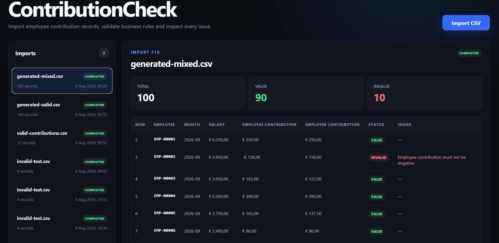
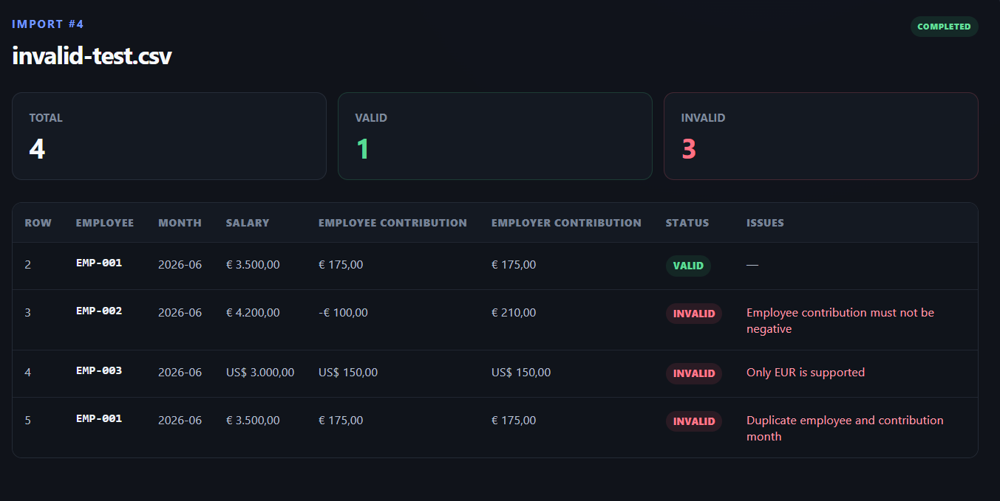

# ContributionCheck

ContributionCheck is a full-stack application for importing employee contribution records from CSV files, validating them against business rules, and inspecting validation issues down to the individual row.

The project demonstrates a complete data-import pipeline: multipart upload, CSV parsing, domain validation, transactional persistence, database migrations, REST APIs, automated tests, and a React dashboard.

## Demo

### Generated dataset import



The dashboard summarizes a generated 100-row dataset and provides immediate visibility into valid and invalid records.

### Row-level validation



Each invalid record contains a specific validation issue. The example demonstrates negative contributions, unsupported currencies, and duplicate employee/month entries.


The dashboard shows import history, validation statistics, individual contribution records, and row-level validation issues.


A generated mixed dataset demonstrates validation across larger CSV imports.

## Features

- Import contribution records from CSV files
- Validate every row against business rules
- Detect duplicate employee/month records within an import
- Store imports, records, and validation issues in PostgreSQL
- View import history and processing statistics
- Inspect valid and invalid rows in the web interface
- Return structured API errors for malformed files
- Generate deterministic test datasets with Python

## Validation rules

A row is marked as invalid when:

- an employee or employer contribution is negative;
- the combined contributions exceed the gross salary;
- the currency is not `EUR`;
- the same employee and contribution month appear more than once in one import.

Malformed CSV values, such as an invalid month or number, cause the entire import request to return `400 Bad Request`.

## Tech stack

### Backend

- Java 21
- Spring Boot
- Spring Web
- Spring Data JPA / Hibernate
- PostgreSQL 17
- Flyway
- Maven Wrapper
- JUnit 5
- Testcontainers

### Frontend

- React
- TypeScript
- Vite
- Yarn
- CSS

### Infrastructure

- Docker Compose
- PostgreSQL container with health check

## Project structure

```text
ContributionCheck/
├── backend/
│   └── contribution-check-api/
├── frontend/
├── sample-data/
├── scripts/
│   └── generate_contributions.py
├── docker-compose.yml
└── README.md
```

## Prerequisites

- Java 21
- Docker Desktop
- Node.js
- Yarn
- Python 3.10+ — only required for generating test data

## Running locally

### 1. Start PostgreSQL

From the project root:

```bash
docker compose up -d
```

Check that the database is healthy:

```bash
docker compose ps
```

### 2. Start the backend

On Windows PowerShell:

```powershell
cd backend/contribution-check-api
./mvnw.cmd spring-boot:run
```

On Linux or macOS:

```bash
cd backend/contribution-check-api
./mvnw spring-boot:run
```

The API runs at `http://localhost:8080`.

### 3. Start the frontend

In a second terminal:

```bash
cd frontend
yarn install
yarn dev
```

Open `http://localhost:5173`.

## CSV format

ContributionCheck expects the following header:

```csv
employeeId,contributionMonth,grossSalary,employeeContribution,employerContribution,currency
```

Example:

```csv
employeeId,contributionMonth,grossSalary,employeeContribution,employerContribution,currency
EMP-001,2026-08,3500.00,175.00,175.00,EUR
EMP-002,2026-08,4200.00,210.00,210.00,EUR
```

Requirements:

- `contributionMonth` must use the `YYYY-MM` format;
- monetary values must use a dot as the decimal separator;
- `employeeId` must not be blank;
- only `EUR` is currently supported.

Ready-to-use files are available in [`sample-data`](sample-data).

## Generate test data

Create a valid dataset with 1,000 rows:

```bash
python scripts/generate_contributions.py \
  --rows 1000 \
  --month 2026-09 \
  --seed 42 \
  --output sample-data/generated-valid.csv
```

Create a mixed dataset with 10% intentionally invalid rows:

```bash
python scripts/generate_contributions.py \
  --rows 1000 \
  --month 2026-09 \
  --invalid-rate 0.10 \
  --seed 42 \
  --output sample-data/generated-mixed.csv
```

The `--seed` option makes generated datasets reproducible.

## REST API

| Method | Endpoint | Description |
| --- | --- | --- |
| `GET` | `/api/imports` | List all imports |
| `POST` | `/api/imports` | Upload and process a CSV file |
| `GET` | `/api/imports/{id}/records` | Get all records and issues for an import |

Upload a file with cURL:

```bash
curl -X POST http://localhost:8080/api/imports \
  -F "file=@sample-data/valid-contributions.csv"
```

Example response:

```json
{
  "id": 5,
  "fileName": "valid-contributions.csv",
  "status": "COMPLETED",
  "totalRecords": 12,
  "validRecords": 12,
  "invalidRecords": 0,
  "createdAt": "2026-08-06T00:30:00Z"
}
```

## Tests

Run backend unit and integration tests:

```powershell
cd backend/contribution-check-api
./mvnw.cmd test
```

The integration tests use Testcontainers, so Docker must be running.

Build the frontend:

```bash
cd frontend
yarn build
```

## Database model

The application stores data in three related tables:

- `import_batches` — uploaded files and processing statistics;
- `contribution_records` — parsed contribution rows;
- `validation_issues` — one or more validation errors linked to a record.

Flyway applies the database schema automatically when the backend starts.

## Current limitations

- only CSV files are supported;
- only EUR contributions are accepted;
- imports are processed synchronously;
- authentication and authorization are not implemented.

## License

This project is available for educational and portfolio purposes.
